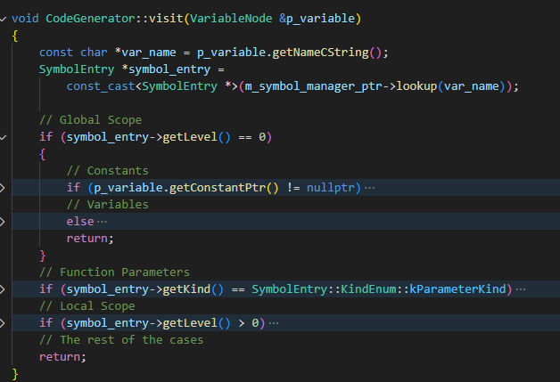
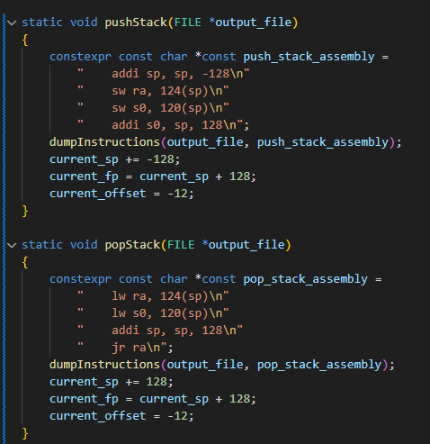
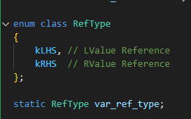
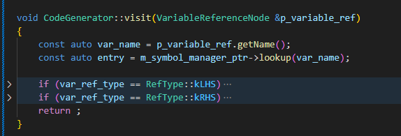
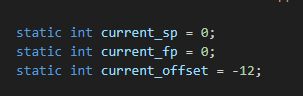

# hw5 report

|||
|-:|:-|
|Name|黃威凱|
|ID|109511028|

## How much time did you spend on this project

> 6 hours.

## Project overview

### VariableNode
* 4 kinds of scope
    * global
        * constant
        * variable
    * function parameters
    * local
        * constant
        * variable

### Scope Management
* Every time we enter ProgramNode or FunctionNode, we need to generate this same section of code.

### LValue & RValue
* Variable could be referenced at the LHS or RHS, they require diffrent procedure of instruction, so a static variable `var_ref_type` is to imply where are we now.
* In these nodes, variables are referenced at the LHS.
    * VariableReferenceNode
    * AssignmentNode
    * ReadNode
    * ForNode
* In these nodes, variables are referenced at the RHS.
    * VariableReferenceNode
    * AssignmentNode
    * ForNode
    * ReturnNode
    * PrintNode
    * BinaryOperatorNode
    * UnaryOperatorNode

### StackPointer handling
* This is handled using static global variables in `Codegenerator.cpp`

## What is the hardest you think in this project

> Not required, but bonus point may be given.

## Feedback to T.A.s

> Not required, but bonus point may be given.
